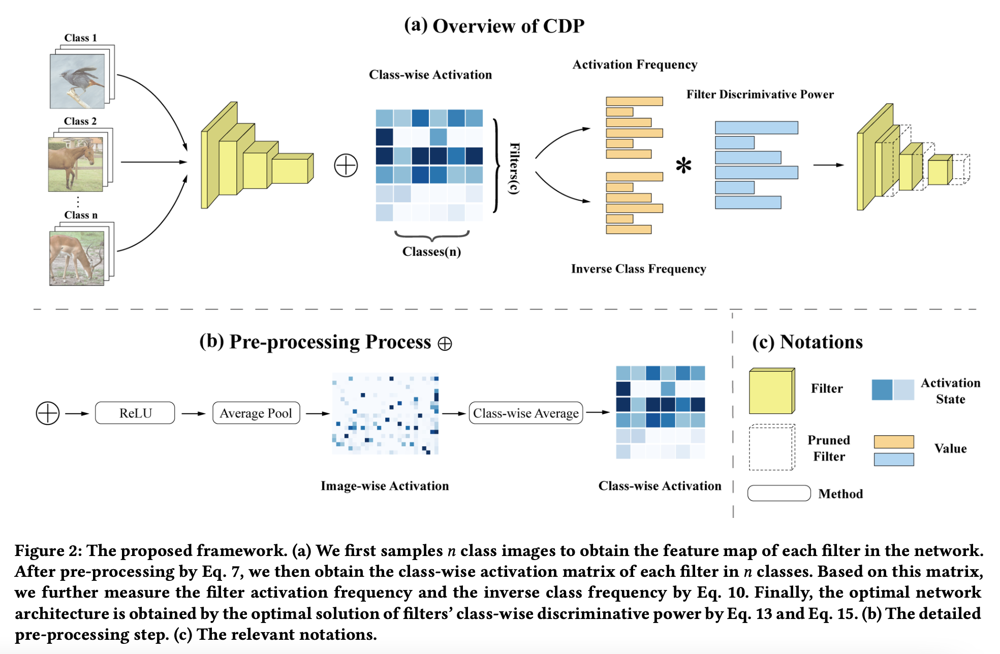
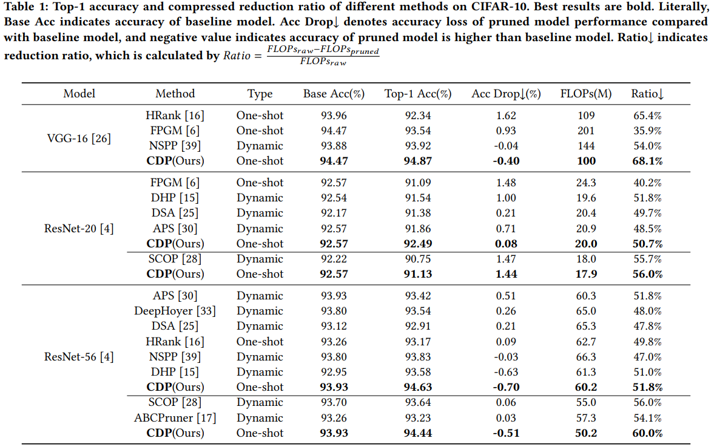
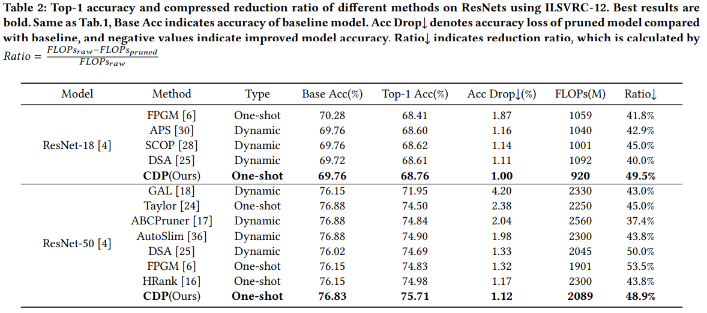

# CDP: Towards Optimal Filter Pruning via Class-wise Discriminative Power

This repo contains code and data of  all experiments of our paper. We also offer google drive link of some finetuned model weight files which we listed in our paper (https://doi.org/10.1145/3474085.3475680).



## Requirements

### Environment

- pytorch 1.7.0
- torchvision 0.7.0
- NNI 2.0

### Datasets

CIFAR-10

ImageNet

## Performance

[Google drive link](https://drive.google.com/drive/folders/16rWTzg5OMy5I7kC1K3NXiumMIrfLBx2m?usp=sharing) for Pretrained model  and Finetuned weight files 

### CIFAR-10



### ImageNet



## Running

There are three parts in our experiments:

1. Record feature maps generated by models based on sampled data
2. Use feature maps to create CDP pruner,  and execute pruning
3. Retrain pruned models

### CIFAR10

Because the scale of cifar10 is relatively small and the computation cost of statistical characteristic graph is small, we directly complete three parts in one file.

```shell
python prune_cifar.py \
    --model resnet20 \ # select model
    --pretrained_dir "./ckpt/base/resnet20_model_best.pth.tar" \
    --dataroot "/gdata/cifar10/" \ # dataset dir
    --gpus 0,1 \ # denote which gpu to use
    -j 4 \ # set number of dataloder worker
    --stop_batch 200 \ # set batch number of sampled data
    --sparsity 0.5 # set the sparsity of model != reduced_flops_ratio
    # --coe 0 \ # hyper parameter of CDP
```

Other parameters are listed in [prune_cifar.py](./prune_cifar.py).

### ImageNet

Because of the large scale of Imagenet and the high computation cost of statistical characteristic graph, we carried out the experiment in two steps

**First**, accumulate feature maps and prune the model.

```shell
python statistic_imagenet.py \
    --model resnet50 \
    --pretrained_dir "./ckpt/base/resnet50_model_best.pth.tar" \
    --dataroot "/gdata/image2012/" \ # path to dataset
    --gpus 0,1 \
    -j 4 \ # Number of dataloader worker
    --stop_batch 200\ # Number of sampled data
    --sparsity 0.5 \ # Sparsity of model
```

Other parameters are listed in [statistic_imagenet.py](./statistic_imagenet.py).

**Second**, retrain the pruned model

```shell
cd ./imagenet
python imagenet.py \
    --model resnet50 \
    --resume "./ckpt/resnet50_s4.pth" \
    --dataroot "/gdata/image2012/" \
    --gpus 0,1 \
    -j 4 \
    --batch-size 128 \
    --epochs 200\
    --make-mask \
    # --warmup 1 \
    # --label-smoothing 0.1 \
```

Other parameters are listed in [imagenet.py](./imagenet/imagenet.py).
