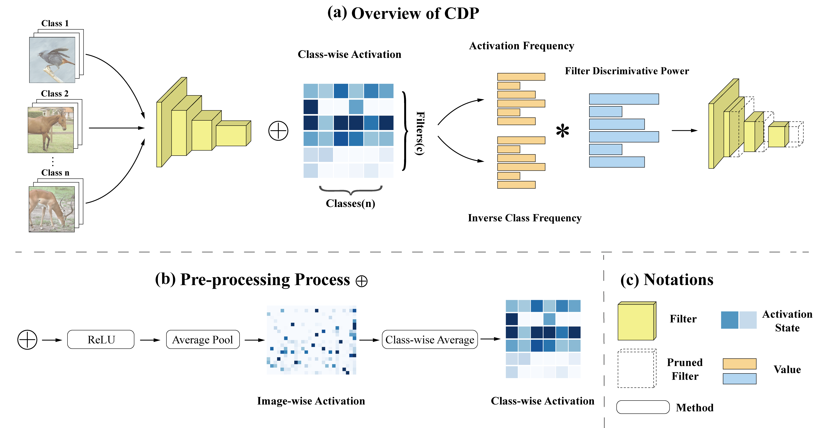
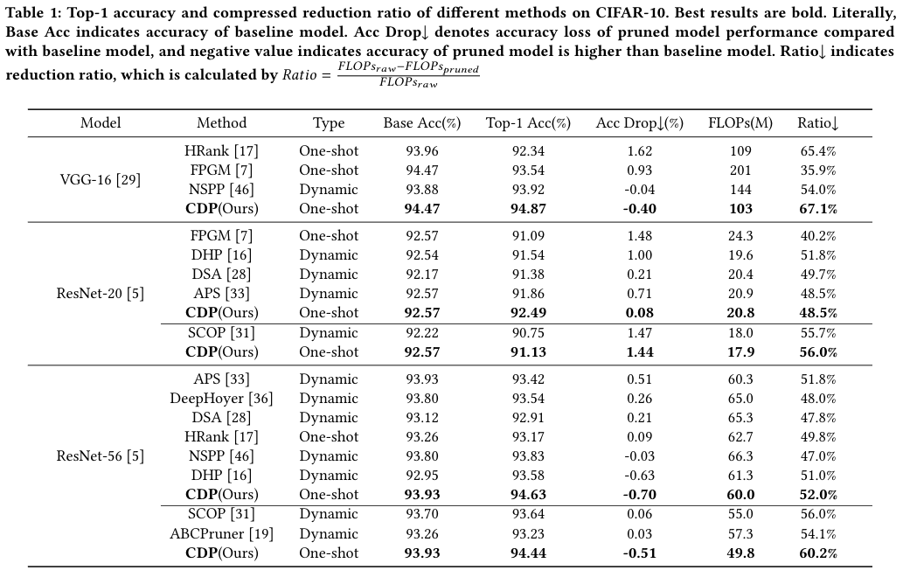
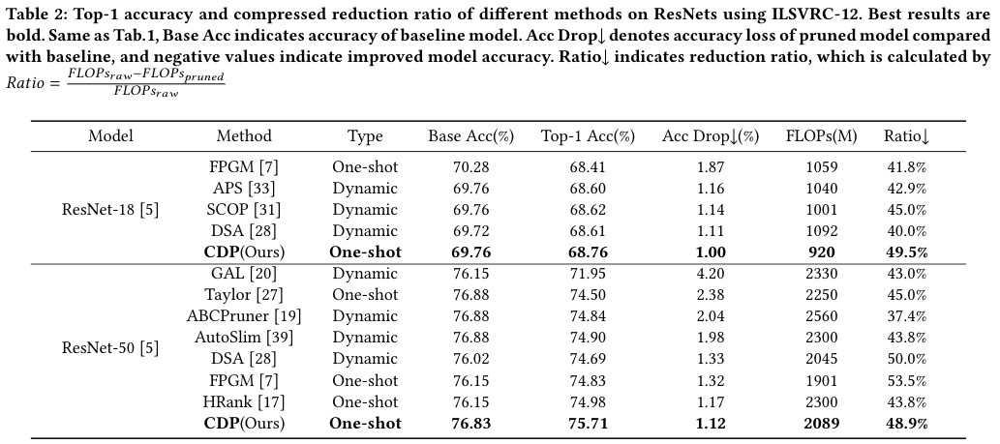

# CDP: Towards Optimal Filter Pruning via Class-wise Discriminative Power (ACM MM '21)



### https://doi.org/10.1145/3474085.3475680
We proposed a novel filter pruning strategy via class-wise discriminative power (CDP). CDP quantizes the discriminative power by introducing the Term Frequency-Inverse Document Frequency (TF-IDF) into deep learning to quantize filters across classes. Specifically, CDP regards the output of a filter as a word and the whole feature map as a document. TF-IDF is used to generate the relevant score between the words (filters) and all documents (classes), *i.e.,* filters that always have low TF-IDF scores are less discriminative and thus need to be pruned. In particular, CDP does not require any iterative training or search process, which is simple and straight forward.

## Requirements

### Environment

- python 3.6
- pytorch 1.7.0
- torchvision 0.7.0
- NNI 2.0

### Datasets

CIFAR-10

ImageNet

## Performance

### CIFAR-10
| Model      | FLOPs(M) | Base FLOPs(M) | Accuracy(%) | Baseline Acc(%) | MindSpore |
| ----------- | ----------- | ----------- | ----------- | ----------- | ----------- |
| [VGG16](https://drive.google.com/file/d/13GXcYyb3pcI6zdZX_7FHe9SraAFt_uDE/view?usp=sharing)    | 103.3    |   313.5  | 94.87 | 94.47 | [Link](https://drive.google.com/file/d/1slb91ih7wN8fz2n_k9j9025vcTjholxG/view?usp=sharing) |
| [ResNet20](https://drive.google.com/file/d/1ArMYGnGzgUVN_NdvSAWQGG6G_mwU1cI3/view?usp=sharing)    | 20.76 | 40.6 | 92.49 | 92.57 | [Link](https://drive.google.com/file/d/1wfGjAHfiLHGR5V4YoRPlwsL09OXrGmTa/view?usp=sharing) |
| [ResNet56](https://drive.google.com/file/d/1Kw95v4odKgNO91YYcHv1517NfdoqtphD/view?usp=sharing)   | 60.02  | 125 | 94.63 | 93.93 |  |
| [ResNet56](https://drive.google.com/file/d/1V1Cg7IMLnZibvPYN8FfZ5pofjzVhYN-H/view?usp=sharing)   | 49.84  |  125 | 94.44 | 93.93 |  |



### ImageNet
| Model      | FLOPs(M) | Base FLOPs(M) | Accuracy(%) | Base Acc(%) |
| ----------- | ----------- | ----------- | ----------- | ----------- |
| [ResNet18](https://drive.google.com/file/d/19x-zjQHl1nBDfp6Kgq-vNPXEhFKtP_ha/view?usp=sharing)   | 920  | 1820 | 68.76 | 69.76 |
| [ResNet50](https://drive.google.com/file/d/1nT74i3hG89GkqytYRF8lllBRYIIZ2KzT/view?usp=sharing)   | 2089  |  4089 | 75.71 | 76.83 |




## Running

There are three parts in our experiments:

1. Record feature maps generated by models based on sampled data
2. Use feature maps to create CDP pruner,  and execute pruning
3. Retrain pruned models

### CIFAR10

Because the scale of cifar10 is relatively small and the computation cost of statistical characteristic graph is small, we directly complete three parts in one file.

```shell
python prune_cifar.py \
    --model resnet20 \ # select model
    --pretrained_dir "./ckpt/base/resnet20_model_best.pth.tar" \
    --dataroot "/gdata/cifar10/" \ # dataset dir
    --gpus 0,1 \ # denote which gpu to use
    -j 4 \ # set number of dataloder worker
    --stop_batch 200 \ # set batch number of sampled data
    --sparsity 0.5 # set the sparsity of model != reduced_flops_ratio
    # --coe 0 \ # hyper parameter of CDP
```

Other parameters are listed in [prune_cifar.py](./prune_cifar.py).

### ImageNet

Because of the large scale of Imagenet and the high computation cost of statistical characteristic graph, we carried out the experiment in two steps

**First**, accumulate feature maps and prune the model.

```shell
python statistic_imagenet.py \
    --model resnet50 \
    --pretrained_dir "./ckpt/base/resnet50_model_best.pth.tar" \
    --dataroot "/gdata/image2012/" \ # path to dataset
    --gpus 0,1 \
    -j 4 \ # Number of dataloader worker
    --stop_batch 200\ # Number of sampled data
    --sparsity 0.5 \ # Sparsity of model
```

Other parameters are listed in [statistic_imagenet.py](./statistic_imagenet.py).

**Second**, retrain the pruned model

```shell
cd ./imagenet
python imagenet.py \
    --model resnet50 \
    --resume "./ckpt/resnet50_s4.pth" \
    --dataroot "/gdata/image2012/" \
    --gpus 0,1 \
    -j 4 \
    --batch-size 128 \
    --epochs 200\
    --make-mask \
    --warmup 1 \
    --label-smoothing 0.1 \
```

Other parameters are listed in [imagenet.py](./imagenet/imagenet.py).

## License
The entire code is under the [MIT License](./LICENSE)

## Citation
\[1] Tianshuo Xu, Yuhang Wu, Xiawu Zheng, Teng Xi, Gang Zhang, Errui Ding,Fei Chao, and Rongrong Ji. 2021. CDP: Towards Optimal Filter Pruningvia Class-wise Discriminative Power. InProceedings of the 29th ACM Int’lConference on Multimedia (MM ’21), Oct. 20–24, 2021, Virtual Event, China.ACM, New York, NY, USA, 10 pages. https://doi.org/10.1145/3474085.3475680
